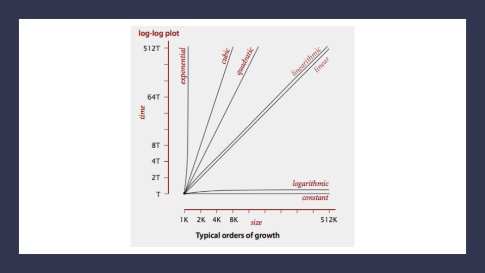

# BigO

Big O(oh) notation is used to describe the efficiency of an algorithm or function. Big O’s role in algorithm efficiency is to describe the Worst Case of efficiency an algorithm can have in performing it’s job. This efficiency is evaluated based on  time complexity (The amount of time a function needs to complete.) and space complexity (The amount of memory resources a function uses to store data and instructions.)

In order to analyze these limiting factors, we should consider 4 Key Areas for analysis:

- Input Size
- Units of Measurement
- Orders of Growth
- Best Case, Worst Case, and Average Case

 

## Input Size
Input Size refers to the size of the parameter values that are read by the algorithm. We will use the letter n to refer to the Input Size value.

 

## Units of Measurement

In order to quantify the Running Time in our analysis, we will consider Three Measurements of time:

- The ***Running Time*** in milliseconds. It is different from device to another, so it can't be used.
- The number of ***Operations*** that are executed(number of lines).
- The number of ***Basic Operations*** that are executed. Basic Operation refers to the operation that is contributing the most to the total running time. Which is usually the most time consuming operation.

In order to quantify Memory Space, we can consider Four Sources of Memory Usage during function run-time:

- The space needed to hold the code for the algorithm(number of bytes).
- The space needed to hold the input data.
- The space needed for the output data.
- The space needed to hold working space during the calculation(Stack Space)

 

## Orders of Growth

Order of Growth represents the increase in Running Time or Memory Space.

- ***Constant Complexity O(1):*** means that no matter what inputs are thrown at our algorithm, it always uses the same amount of time or space. 

- ***Logarithmic Complexity O(lgn):*** represents a function that sees a decrease in the rate of complexity growth, the greater our value of n. This can be seen when we are performing calculations on sorted data. 

- ***Linear Complexity O(n):*** the size of our inputs ‘n’ will directly determine the amount of Memory Space used and Running Time length. This is a very common efficiency and is usually used to denote functions with loops, or often algorithms that use recursion.

- ***Linearithmic Complexity O(n*lgn):*** is used to describe a growth rate of n by lgn. This represents complexity that grows with n, but also by lgn. Linearithmic functions grow faster than input size n, but not by much. This can be seen in divide and conquer algorithms such as the Merge Sort have linearithmic complexity growth rates.

- ***Quadratic Complexity O(n^2):*** describes an algorithm with complexity growing at a rate of input size n multiplied by n. This is often seen in algorithms that have nested loops which perform iterative or recursive logic on all values of n and immediately iterate or recurse again for each value of n. Often seen in brute force comparison functions that compare all values of an iterable with each other value.

- ***Cubic Complexity O(n^3):*** is typically just a higher degree of what makes the quadratic complexity grow at such a high rate. We can illustrate this by nesting more loops within our algorithm. An example of Cubic efficiency could involve an additional set of nested loops.

- ***Exponential Complexity O(2^n):*** represents very rapidly growing complexity, such that whatever our input size n, we are performing the same number of iterative or recursive loops as n. If we have to examine subsets of a set of data, and compare against all possible subsets, we may have exponential complexity growth. The fibonacci sequence is a popular case for exponential complexity growth.

- ***Factorial Complexity O(n!):*** means that the our space and time requirements grow extremely fast, relative to our input size. At this rate we are performing an extreme amount of calculations for every value within our input of size n. This aften happens with we need to calculate all possible permutations of something like a string or an array.

 

## Worst Case, Best Case, Average Case

Even though Big O describes the Worst Case for algorithm efficiency, we can still think about Best and Average cases.

- Worst Case: The efficiency for the worst possible input of size n, for unsorted or undefined value.

- Best Case: The efficiency for the best possible input of size, for sorted and easy to find values.

- Average Case: The efficiency for a “typical” or “random” input of size n, makes a typical assumption about the possible inputs of size n.

 

## Asymptotic Notations

- ***Big O(oh):*** This notation describes the Worst Case for an algorithm. The Order of Growth used represents the upper bounds of Time and Space.
- ***Big Omega:*** This notation describes the Best Case for a given algorithm. The Order of Growth used represents the lower bounds of Time and Space.
- ***Big Theta:*** This notation describes the Average Case. The Order of Growth used represents the tight bound of Time and Space.

 

 

 

## [Read more](https://codefellows.github.io/common_curriculum/data_structures_and_algorithms/Code_401/class-05/resources/big_oh.html)
