# SQL Practice

# Introduction

SQL, or Structured Query Language, is a language designed to manipulate data and data bases. SQL databases provide safe and scalable relational storage. There are many popular SQL databases such as SQLite, MySQL, Postgres, Oracle and Microsoft SQL Server.

For example if we have a dabase about vehicles specs as the table below, using SQl you can answer question like "What types of vehicles are on the road have less than four wheels?", or "How many models of cars does Tesla produce?", to help us make better decisions down the road.

|Id|Make/Model|# Wheels|# Doors|Type|
|---|---|---|---|---|
|1|Ford Focus|4|4|Sedan|
|2|Tesla Roadster|4|2|Sports|
|3|Kawakasi Ninja|2|0|Motorcycle|
|4|McLaren Formula 1|4|0|Race|
|5|Tesla S|4|4|Sedan|

 

# 1: SELECT queries

A query in itself is just a statement which declares what data we are looking for, where to find it in the database, and optionally, how to transform it before it is returned.

> SELECT column, another_column, …  
>
>FROM mytable;

 

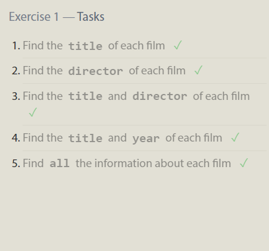

 

# 2: Queries with constraints (Pt. 1)

In order to filter certain results from being returned, we need to use a WHERE clause in the query. The clause is applied to each row of data by checking specific column values to determine whether it should be included in the results or not. In addition to making the results more manageable to understand, writing clauses to constrain the set of rows returned also allows the query to run faster due to the reduction in unnecessary data being returned.

 

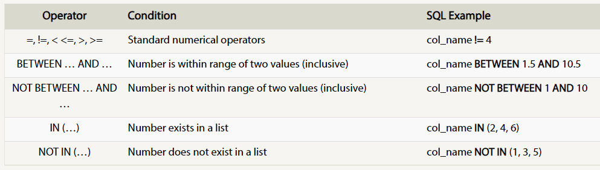

 

>SELECT column, another_column, … 
>
>FROM mytable
>
>WHERE condition AND/OR another_condition AND/OR …;

 

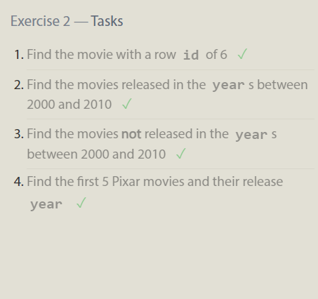

 

# 3: Queries with constraints (Pt. 2)

SQL supports a number of useful operators to do things like case-insensitive string comparison and wildcard pattern matching. Most database implementations are quite efficient when using these operators, full-text search is best left to dedicated libraries like Apache Lucene or Sphinx. 

 

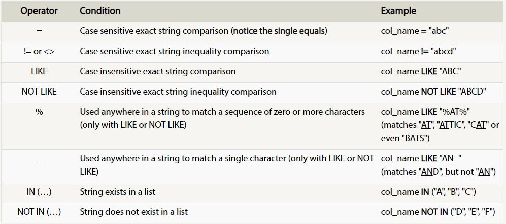

 

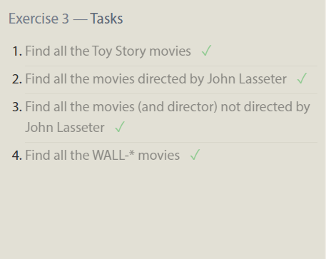

 

# 4: Filtering and sorting Query results

It is commot to have rows that have a duplicate column value such as release year. SQL provides a convenient way to discard rows that have a duplicate column value by using the `DISTINCT` keyword. However you can discard duplicates based on specific columns using grouping and the `GROUP BY` clause.

> SELECT DISTINCT column, another_column, …
>
> FROM mytable
>
> WHERE condition(s);

 

Most data in real databases are added in no particular column order. As a result, it can be difficult to read through and understand the results of a query as the size of a table increases to thousands or even millions rows. SQL provides a way to sort your results by a given column in ascending or descending order using the `ORDER BY` clause. In some databases, you can also specify a collation to better sort data containing international text. The `LIMIT` clause will reduce the number of rows to return, and the optional `OFFSET` clause will specify where to begin counting the number rows from.

> SELECT column, another_column, …
>
> FROM mytable
>
> WHERE condition(s)
>
> ORDER BY column ASC/DESC;
>
> LIMIT num_limit OFFSET num_offset;

 

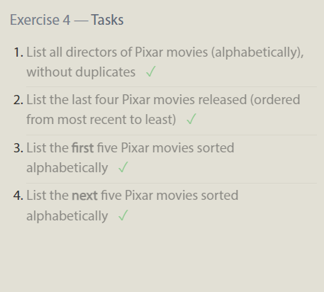

 

# 5:Review: Simple SELECT Queries

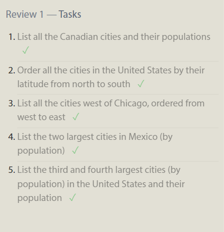

 

# 6: Multi-table queries with JOINs

Data in the real world is often broken down into pieces and stored across multiple orthogonal tables using a process known as normalization. Tis minimizes duplicate data in any single table, and allows for data in the database to grow independently of each other. Tables that share information about a single entity need to have a primary key that identifies that entity uniquely across the database.

The `JOIN` or `INNER JOIN` is a process that matches rows from the first table and the second table which have the same key (as defined by the ON constraint) to create a result row with the combined columns from both tables.

 

> SELECT column, another_table_column, …
>
> FROM mytable
>
> INNER JOIN another_table ON mytable.id = another_table.id
>
> WHERE condition(s)
>
> ORDER BY column, … ASC/DESC
>
> LIMIT num_limit OFFSET num_offset;

 

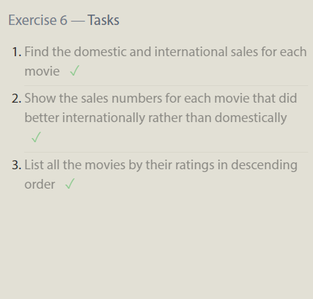

 

# 13: Inserting rows

In SQL, the database schema is what describes the structure of each table, and the datatypes that each column of the table can contain. So, in tables the columns being the properties and the rows being instances of the entity.

To insert data into a database, we need to use an `INSERT` statement, which declares which table to write into, the columns of data that we are filling, and one or more rows of data to insert.

 

> INSERT INTO mytable (column, another_column, …)
>
>VALUES (value_or_expr, another_value_or_expr, …),
 (value_or_expr_2, another_value_or_expr_2, …), …;

  

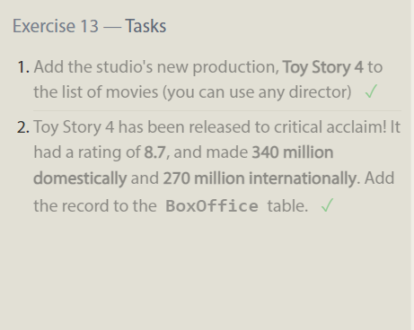

 

# 14: Updating rows

Update existing data can be done using an `UPDATE` statement. You have to specify exactly which table, columns, and rows to update. In addition, the data you are updating has to match the data type of the columns in the table schema.

> UPDATE mytable 
>
>SET column = value_or_expr, other_column = another_value_or_expr, …
>
>WHERE condition;

  

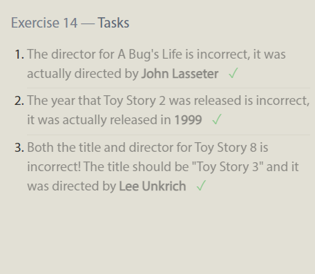

 

# 15: Deleting rows

When you need to delete data from a table in the database, you can use a DELETE statement, which describes the table to act on, and the rows of the table to delete through the WHERE clause.

> DELETE FROM mytable
>
> WHERE condition;

  

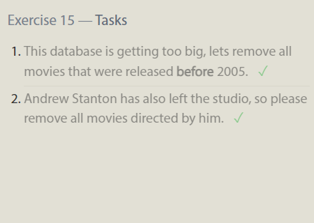

 

# 16: Creating tables

The structure of the new table is defined by its table schema, which defines a series of columns. Each column has a name, the type of data allowed in that column, an optional table constraint on values being inserted, and an optional default value. IF `NOT EXISTS clause` is added to `CREATE TABLE` to skip the command if a table with the same name already exists.

> CREATE TABLE IF NOT EXISTS mytable (
    >
> column DataType TableConstraint DEFAULT default_value,
>
 >   another_column DataType TableConstraint DEFAULT default_value,
 >
>  …
>
> );

 

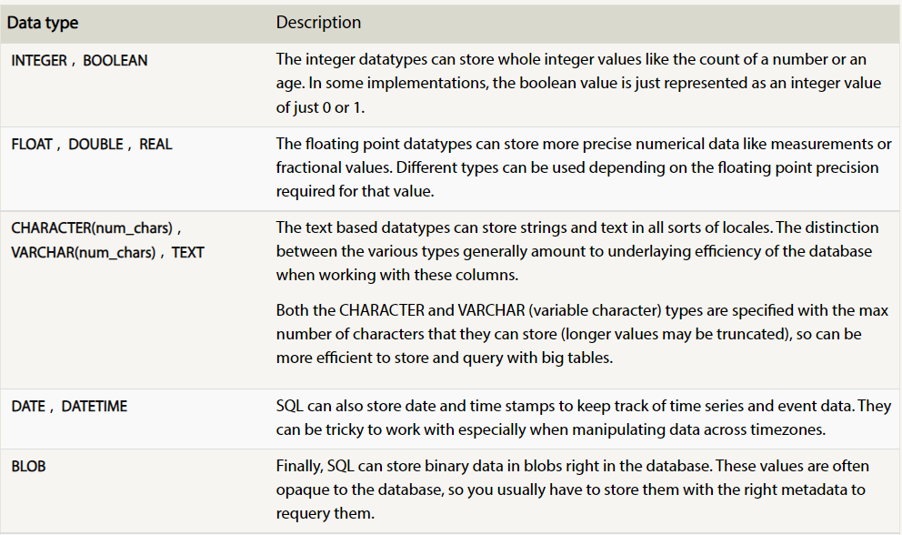

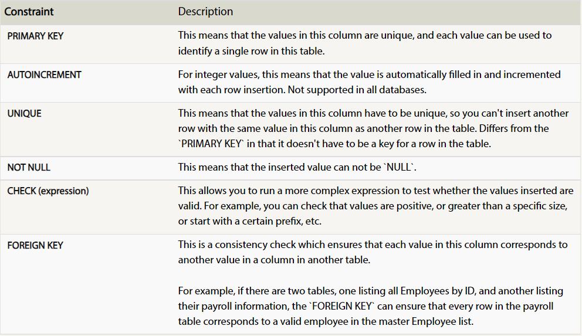

 

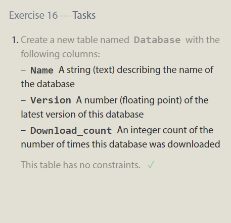

 

# 17: Altering tables

`ALTER TABLE` is statement let you add, remove, or modify columns and table constraints.

 Adding columns: You need to specify the data type of the column along with any potential table constraints and default values to be applied to **both existing and new rows.** You can  specify where to insert the new column using the `FIRST` or `AFTER` clauses.

> ALTER TABLE mytable
>
> ADD column DataType OptionalTableConstraint DEFAULT default_value;

Removing columns:  some databases don't support this feature. Instead you may have to create a new table and migrate the data over.

>ALTER TABLE mytable
>
>DROP column_to_be_deleted;

Renaming the table:

> ALTER TABLE mytable
>
> RENAME TO new_table_name;

 

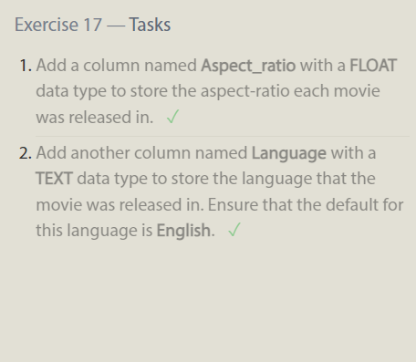

 

# 18: Dropping tables

`DROP TABLE` statement removes the table schema from the database entirely. `DELETE` statement removes the data from the table without removing it compleatly.

> DROP TABLE IF EXISTS mytable;

 

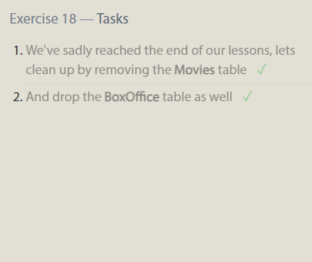

 