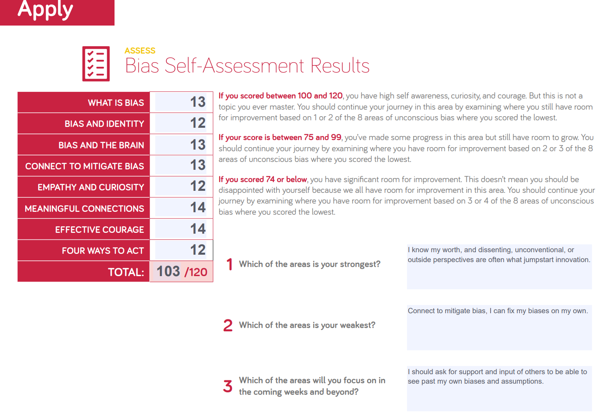

# reading-notes

# The Growth Mindset

## Upgrade your technical skills with deliberate practice

Science improvs continuously very fast in every aspect, this is the main reason for this consecutive revolution in it, which is perfect. For example every day we discover a new treatment or invent a new device that makes someone's life easier. But we have to pay an expensive tax for this, this tax is the urgent need for continuous development for every specialest. We all know that the learning process requires going outside your comfort zone.

 >"Set yourself a small, finishable challenge that teaches you something further outside your comfort zone." [[1]](https://web.archive.org/web/20160616225417/http://www.happybearsoftware.com/upgrade-your-technical-skills-with-deliberate-practice)

Working every day in your field doesn't mean necessarily that you are learning, you have to try new things, new methods, new concepts, and be up to date with the new inventions in your field.

> "If you build software you program every day. That doesn't mean you get better at programming every day."   [[1]](https://web.archive.org/web/20160616225417/http://www.happybearsoftware.com/upgrade-your-technical-skills-with-deliberate-practice) 

 

## The power of believing that you can improve

According to Carol Dweck, Don't grip in the tyranny of now, instead stick on luxuriating in the power of yet. means that when you face a difficulty consider it a challenge that will be solved, not a rock couldn't be moved. then start working on it immediately.

 

## The power of passion and perseverance

IQ isn't the major factor that affects success as it was popular, nor social intelligence, the major factor is grit. Of course IQ and social intelligence are influential factors, but modern statistics show that grit is the main factor in success.
That is what Angela Lee Duckworth thinks, and I totally agree with her. Let's take Elon Musk as an example, he failed to build a rocket three times then eventually he succeeded. He was also the first person who dares to revive the concept of the electric car after a hundred years of laziness and fear of failure in other vehicle industry leaders.

 

## A kinder, gentler philosophy of success

Success is not trapped in making money. You can't succeed in all aspects of life. If someone is not successful, surely this does not mean that he is not a good person, nor he must be at the bottom of the society, he could have a serious challenge prevent him to be "successful" in our point of view. 
> Meritocracy is a great thing, and we should all make our society really meritocratic. This means if you've got talent, energy, and skills you will get to the top, nothing should hold you back. The problem is if you really believe in a society where those who merit to get to the top, get to the top, you'll also by implication believe in a society where those who deserve to get to the bottom, also get to the bottom and stay there. in other words, your position in life is not accidental but merited or deserved.
>
> -Alain de Botton

 

## Measuring Emotional Intelligence

My scores were the following:
- Self-Awareness 19/25
- Self-Management 13/25
- Social Awareness 19/25
- Relationship Management 18/25

Which means I have to improve my self in self-management.

 

## Assessing Bias

